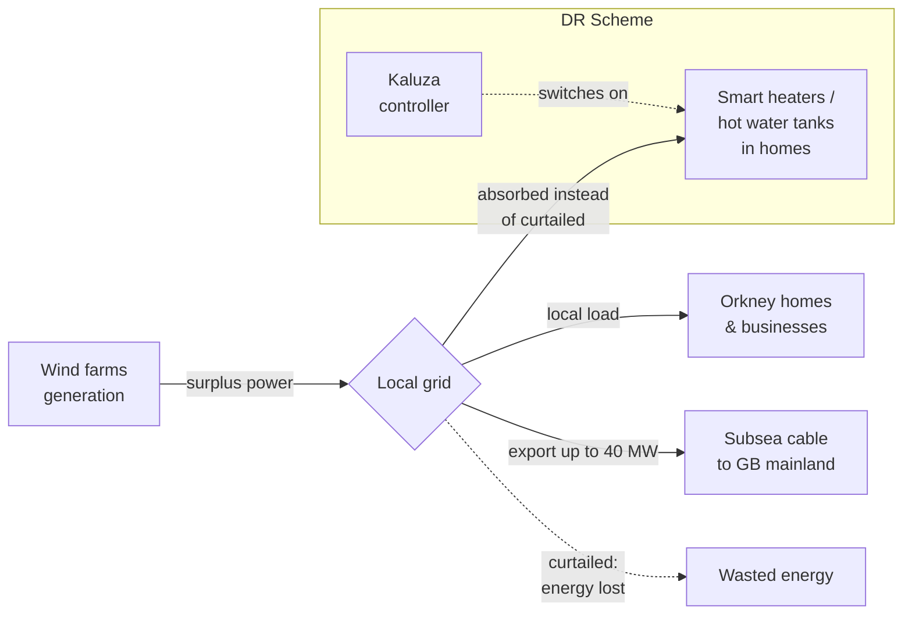

# Heat Smart Orkney — Demand Response Valuation

Capstone consultancy project (AiB 2026). Sizing the £/year prize from residential demand
response on the Orkney Isles. The narrative brief is in [`Project.md`](Project.md); the
engineering blueprint for the notebook pipeline is in [`pla.md`](pla.md).

## Quickstart

```bash
pip install -r requirements.txt        # or: conda env create -f environment.yml && conda activate hso
make test                              # unit tests
make all                               # execute notebook + render HTML + slides
```

The deliverable is `HSO_report.ipynb`, rendered to `reports/HSO_report.html` (technical
report for Kaluza's data team) and `reports/HSO_report.slides.html` (executive deck for
the board).

## Layout

| Path | Purpose |
| --- | --- |
| `Data/` | Raw CSVs (turbine telemetry + residential demand) |
| `src/` | Importable, tested Python modules — the analytical engine |
| `tests/` | Pytest unit tests for `src/` |
| `config/assumptions.yaml` | Central numeric assumption register |
| `config/scenarios.yaml` | Price / penetration scenarios |
| `outputs/` | Generated caches, figures, tables (gitignored) |
| `reports/` | Rendered HTML / PDF / slides (gitignored) |
| `HSO_report.ipynb` | The notebook — single source for all rendered artefacts |

## Deliverable formats

| Output | Audience | Command |
| --- | --- | --- |
| `reports/HSO_report.html` | Kaluza data team | `make html` |
| `reports/HSO_report.pdf`  | Submission archive | `make pdf` |
| `reports/HSO_report.slides.html` | CEO / board | `make slides` |

## Three core questions

1. How much energy is currently curtailed annually across the Orkney Isles?
2. How much can curtailment be reduced at different DR penetration levels?
3. How many households are needed to deliver each level?
> **Capstone consultancy project, AiB 2026.** A business case for using residential demand response (DR) to reduce wind energy curtailment in the Orkney Isles, in partnership with **Community Energy Scotland** and **Kaluza** (formerly part of OVO Energy).

---

## 1. Executive Summary (read this first)

Orkney generates more wind power than its grid cable to mainland Britain can carry. When that happens, wind turbines are **curtailed** (forced to throttle down), and that clean energy — and the revenue it would have earned — is simply lost.

The proposed alternative: instead of switching turbines **off**, switch local devices **on**. Heaters, hot water tanks, and other flexible household loads can soak up the surplus wind energy that would otherwise be wasted. This is called **Demand Response (DR)**.

**Our job, as consultants, is to put a number on the prize.** We must quantify:

1. How much wind energy is currently curtailed in Orkney each year.
2. How much of that curtailment can be avoided at different levels of DR adoption.
3. How many Orkney households would need to enrol to capture that value.

The deliverable is a Jupyter Notebook report (for Kaluza's data team) plus a short executive presentation (for the CEO / board).

---

## 2. The Energy Context — A Quick Primer

If you are new to power systems, the only physics you need to know is this:

> **Electricity supply and demand must always be in perfect balance, in real time.**
> If they are not, the grid frequency drifts and equipment trips offline.

Historically the **supply side** chases demand: gas plants ramp up when people switch the kettle on. That works fine for fossil fuels because we control the throttle.

Wind and solar are different. We can't tell the wind to blow harder. So in a renewables-heavy system, balancing increasingly has to come from the **demand side** — i.e. shifting *when* people consume energy.

### 2.1 Why Orkney specifically?

Orkney is a small archipelago off the north coast of Scotland with an unusual energy profile:

| Feature              | Value / Description                                     |
| -------------------- | ------------------------------------------------------- |
| Status               | **Net energy exporter** (renewables > local demand)     |
| Generation mix       | Heavy wind penetration, plus some solar / wave / tidal  |
| Link to GB mainland  | A single **40 MW** subsea interconnector cable          |
| Constraint           | Cable capacity, not generation capacity                 |
| Curtailment order    | Reverse commissioning order — **newest turbines first** |

Because Orkney has more wind capacity than the cable can export, whenever local wind > local demand + 40 MW cable headroom, the network operator forces some turbines to throttle down. The newest wind farms (often the smaller, community-owned ones) get curtailed first and lose the most revenue.

### 2.2 The DR proposition, visualised



**Without DR:** surplus wind → curtailed → £0 revenue.
**With DR:** surplus wind → consumed by Orkney homes → revenue at wholesale price + cheaper energy for residents + less waste.

### 2.3 Who benefits, and why each party cares

| Stakeholder              | Benefit                                                                |
| ------------------------ | ---------------------------------------------------------------------- |
| **Wind generators**      | Get paid for energy that would otherwise be curtailed (lost revenue).  |
| **Orkney households**    | Discounted / free energy during DR events; lower fuel-poverty risk.    |
| **Kaluza (DR provider)** | Commercial revenue from a proven, scalable DR product.                 |
| **The grid / UK plc**    | More renewables actually delivered; fewer expensive cable upgrades.    |
| **Climate**              | Higher renewable utilisation, lower curtailment of zero-carbon energy. |

> **Caveat (important for the report):** during the trial, households are **fully reimbursed**, so the entire curtailment-avoidance value flows to wind generators. Long-term, the value would be split three ways — but the *upper-bound* size of the prize is what we are asked to quantify.

---

## 3. The Business Question

This is, fundamentally, a **business case development** exercise, not a pure modelling exercise. The framing comes directly from Kaluza's senior data scientist:

> *"The value of anything can only be compared to the cost of the alternative."*

So we set the **incumbent situation** (curtailment as it happens today) as our baseline and measure DR against it.

### 3.1 The three core questions to answer

1. **How much energy is currently curtailed annually across the Orkney Isles?**
2. **How much can curtailment be reduced at different levels of DR penetration** (e.g. 5% / 10% / 25% / 50% of households)?
3. **How many households need to be on the scheme** to deliver each level of DR?

### 3.2 Headline metric

```
Annual curtailed energy (MWh/year)  ──►  £ value at wholesale price
```

Everything else (number of homes, switch-on schedules, model accuracy gains) ultimately has to be converted into this £/year number — that is the language the CEO speaks.

### 3.3 Findings statement (not a formal hypothesis)

The project guidelines do **not** require us to formulate an explicit, testable hypothesis up front. Instead we will close the analysis with a **findings statement** — a clear, evidence-backed explanation of what the data shows, framed for both the technical (Kaluza data team) and executive (CEO/board) audiences.

The findings statement will articulate, at a minimum:

- The **scale of curtailment** observed in Orkney over the analysis window (MWh/year and £/year).
- The **shape of the curtailment** — when it occurs, how concentrated it is in time, and therefore how tractable it is for DR.
- The **household enrolment levels** required to absorb meaningful fractions of that curtailment, and the diminishing-returns point.
- The **business-case verdict** — what the prize is worth and the key sensitivities/assumptions behind that number.

Final wording will be locked in once Stage 2–5 analysis is complete; we should resist pre-committing to a number before the data tells us what it is.

---

## 4. The Data

Two CSV files in `Data/`. **No personal data, no PII** — only device-level telemetry and aggregated demand. (Privacy-by-design: Kaluza deliberately keeps PII separate from telemetry; we only ever see the latter.)

### 4.1 `Turbine_telemetry.csv` — the supply side

High-frequency telemetry from wind turbines.

| Field         | Type     | Units     | Description                                          |
| ------------- | -------- | --------- | ---------------------------------------------------- |
| `Timestamp`   | datetime | UTC-ish   | Reading time, ~1 minute granularity                  |
| `Power_kw`    | float    | kW        | **Actual** power being generated at that instant     |
| `Setpoint_kw` | float    | kW        | **Maximum allowed** output (lowered during curtailment) |
| `Wind_ms`    | float    | m/s       | Local wind speed                                     |

| Property        | Value                                       |
| --------------- | ------------------------------------------- |
| Rows            | ~1,069,637                                  |
| Date range      | **2015-05-28 → 2018-01-11**                 |
| Granularity     | ~1-minute samples                           |
| Detecting curtailment | When `Setpoint_kw` is reduced below the turbine's nameplate capacity, or where `Power_kw` is held below the wind-implied power curve |

**Curtailment detection — the crux of the project.** A turbine is curtailed whenever it is *capable* of generating more than its setpoint allows. Our analysis must:

1. Build a **power curve** from `(Wind_ms, Power_kw)` during *uncurtailed* periods (i.e. where `Setpoint_kw` is at nameplate).
2. For each curtailed timestamp, compute **counterfactual power** = power-curve(`Wind_ms`).
3. Curtailed energy = (counterfactual − actual) × time, summed over the year.

### 4.2 `Residential_demand.csv` — the demand side

Aggregated half-hourly residential consumption.

| Field            | Type     | Units    | Description                                          |
| ---------------- | -------- | -------- | ---------------------------------------------------- |
| `Timestamp`      | datetime | UTC-ish  | Half-hour interval start                             |
| `Demand_mean_kw` | float    | kW/home  | **Mean** electrical demand per participating household |
| `N_households`   | int      | count    | Number of households contributing to the mean        |

| Property        | Value                                  |
| --------------- | -------------------------------------- |
| Rows            | ~17,569                                |
| Date range      | **2017-01-01 → 2018-01-01** (1 full year) |
| Granularity     | 30-minute intervals                    |

This tells us how much load a typical Orkney household presents — and, crucially, how much **flexible** load could be shifted into curtailment windows.

### 4.3 Joining supply and demand

The two datasets only **overlap from 2017-01-01 to 2018-01-11** — that is roughly the window that supports a like-for-like, full-year valuation. Pre-2017 turbine data is still useful for power-curve calibration.

```
Turbine telemetry:  2015-05  ████████████████████████████  2018-01
Residential demand:                  2017-01  ████████  2018-01
                                              ▲▲▲▲▲▲▲▲
                                     overlap window for valuation
```

---

## 5. Suggested Analytical Approach

The notebook should walk a reader through these steps, in order. Keep it simple — **most data-science value comes from the basics done well**, not from exotic models. (A high-school-level model that ships beats an unfinished moonshot.)

### Stage 1 — Understand & clean

- Parse timestamps, check for gaps, time-zone consistency, duplicates.
- Per-turbine sanity checks: power vs. wind scatter, setpoint distribution.
- Per-household sanity checks: demand profile shape (morning / evening peaks).

### Stage 2 — Build & analyse the power curve (mandatory deliverable)

A fitted **power curve is a required output of this project**, not an intermediate artefact. It is both the basis for quantifying curtailment and a standalone analytical deliverable that must be presented and discussed in the report.

- Filter the turbine telemetry to **uncurtailed periods only** (i.e. `Setpoint_kw` at nameplate, no flagged downtime).
- Fit `Power_kw = f(Wind_ms)` — start with the canonical empirical shape (cut-in, ramp, rated plateau, cut-out) before considering any fancier model.
- **Plot and analyse the curve**: cut-in wind speed, rated wind speed, rated power, cut-out behaviour, scatter / residuals around the fit, and any drift across the 2015–2018 window. Comment on what the shape implies about turbine behaviour.
- Use the curve as the **counterfactual generator**: for each curtailed timestamp, expected generation = power-curve(`Wind_ms`).
- Sanity-check the curve against published manufacturer curves where possible.

### Stage 3 — Quantify curtailment (Question 1)

- For each curtailed minute, compute counterfactual − actual energy using the Stage 2 power curve.
- Aggregate to **MWh/year** across all turbines on Orkney (scaling assumptions documented — see HSO FAQ on scaling a single turbine to a fleet of ~500).
- Apply a wholesale price assumption (e.g. £/MWh) to give a **£/year** figure.

### Stage 4 — Model the demand side

- Compute average and peak per-household demand.
- Identify **flexible load** (heating, hot-water-style profiles) — the share of demand that DR can realistically dispatch.
- Build a profile of how much each household could absorb during a curtailment event.

### Stage 5 — Match supply to demand (Questions 2 & 3)

- For each curtailment event in the 2017 overlap year, simulate switching on N enrolled households.
- Sweep N from small (e.g. 100 homes) to large (≈ all of Orkney's ~10,385 households).
- Plot **avoided curtailment vs. household enrolment** — identify the diminishing-returns point.

### Stage 6 — Value & sensitivity

- Convert avoided MWh to £ at sensible wholesale price scenarios (low / central / high).
- Document every assumption and its sensitivity (Kaluza's data scientist explicitly recommends being transparent about assumptions to stakeholders).
- Add a rule-of-thumb time buffer: estimate work, multiply by three.

### Stage 7 — Communicate

- One-paragraph value statement in plain English.
- £/year prize size, household count required, key risks.
- A separate technical appendix for Kaluza's data team to reproduce.

---

## 6. Project Deliverables & Structure

Per the official project guidelines (see `Class Documentation/Project Guidlines/HSO project guidelines.pdf`):

### 6.1 Three components

| Component         | Audience                          | Format                         |
| ----------------- | --------------------------------- | ------------------------------ |
| **Report**        | Kaluza data team / technical readers | **Jupyter Notebook (Python)** |
| **Presentation**  | CEO & board (low technical interest) | ≤10 min talk (target: 8 min)   |
| **Peer evaluation** | Other student teams              | Role-played client Q&A + written eval |

### 6.2 Required report sections (checklist)

- [ ] **Title page** — accurate, informative title
- [ ] **Summary** — one paragraph: objective, procedure, results, discussion, conclusion
- [ ] **Introduction** — business problem, three core questions, approach overview
- [ ] **Technologies & techniques** — exact, reproducible process description
- [ ] **Power curve** — fitted curve, plot, parameters, and analytical commentary (mandatory)
- [ ] **Results** — descriptive stats, figures, tables, captions, explanations
- [ ] **Findings statement** — clear, evidence-backed explanation of what the data shows (in lieu of a formal hypothesis verdict)
- [ ] **Discussion** — overall trend, errors, strengths/limitations
- [ ] **Limitations & future directions**
- [ ] **References** (with proper citation convention)
- [ ] **Technical appendices** (well-organised, easy for the client's team to re-run)

### 6.3 Presentation focus

The talk should be **Introduction → Results → Discussion**. Skip the technical implementation — the board cares about £/year, household count, and risks, not about how the power curve was fitted.

### 6.4 Grading dimensions

We will be assessed on:

- Clarity and evidence-quality of the **findings statement** (no formal hypothesis is required by the brief)
- Quality of technical analysis — including the fitted **power curve** and curtailment quantification
- Storytelling & communication
- Actionable insight & feedback to the client
- Reflection & constructive feedback

---

## 7. Project Management & Ways of Working

### 7.1 Roles to assign on day one

- **Project lead** — owns comms, progress documentation, reflective journal, submission.
- **QA lead** — reviews materials before submission. Do **not** leave QA to the last minute.
- Rotate responsibilities through the module so everyone has a turn.

### 7.2 Cadence

- **Weekly formal meetings** for planning, implementation review, evaluation.
- **Daily stand-ups** (5 min) — what I did yesterday, what I'm doing today, what's blocking me. Mirrors the Kaluza team's actual daily practice.
- **Weekly client coaching session** with the teaching team (acting as Kaluza stakeholders) — book these via Hub.

### 7.3 Tooling

- A task tracker (Trello / Notion / GitHub Projects) — every member always has a current task.
- **Git** for version control. This repository is already initialised.
- Escalate blockers early to stakeholders rather than sitting on them.

---

## 8. Repository Layout

```
AiB-Capstone/
├── Project.md                        # ← this document
├── Class Documentation/
│   ├── Project Guidlines/
│   │   ├── HSO project guidelines.pdf            # official rubric
│   │   ├── Heat-Smart-Orkney_ Case details.pdf   # business context
│   │   ├── Project Case Transcript.txt           # video-1 transcript
│   │   └── Kaluza Industry Insights Transcript.txt # video-2 transcript
│   ├── Week 1/
│   │   ├── AiB Intro 2026.pdf
│   │   ├── ENERGY BRIEF.pdf
│   │   ├── Data_Brief_1_Supply.ipynb             # starter analysis
│   │   └── Data_Brief_2_Demand.ipynb             # starter analysis
│   └── Week 2/
│       └── BUSI70251 - Electricity Markets Power Grid Lecture.pdf
└── Data/
    ├── Turbine_telemetry.csv     # supply side  (~1.07M rows, 2015–2018)
    └── Residential_demand.csv    # demand side  (~17.6k rows, 2017)
```

---

## 9. Glossary

| Term                          | Meaning                                                                                                  |
| ----------------------------- | -------------------------------------------------------------------------------------------------------- |
| **Curtailment**               | Forcing a generator (here, a wind turbine) to produce *less* than it physically could, because the grid can't absorb the extra power. The "wasted" energy is the gap between potential and actual output. |
| **Setpoint**                  | The maximum power output the turbine is currently allowed to produce. Equal to nameplate when uncurtailed; reduced during curtailment events. |
| **Power curve**               | The mapping from wind speed to expected power output for a given turbine. Used to compute *counterfactual* (would-have-been) generation. |
| **Demand Response (DR)**      | Adjusting electricity consumption in response to grid signals — here, *increasing* it to absorb surplus wind. |
| **Interconnector**            | The 40 MW subsea cable linking Orkney to mainland GB. The hard constraint behind curtailment.            |
| **Net exporter**              | A region that, on average, sends more electricity out than it imports.                                   |
| **PII**                       | Personally Identifiable Information — kept strictly separate from telemetry under GDPR / privacy-by-design. |
| **IoT firmware**              | The low-level (C/C++) software running on Kaluza-controlled household devices; expensive to update, must be designed carefully up front. |
| **Smart charging (related)**  | Spreading EV charging across off-peak hours — same demand-side-flexibility principle as residential DR.  |
| **Wholesale price**           | The £/MWh price at which generators sell energy into the grid; the basis for valuing avoided curtailment.|

---

## 10. Key Risks & Things to Watch

- **Power-curve assumption drift** — turbines age and may not match a single fitted curve over 2015–2018; consider per-turbine fitting if data supports it.
- **Data overlap window** — only one full year of supply + demand overlap (2017). Annual extrapolation must be done carefully and caveated.
- **Household scaling** — `Demand_mean_kw` is *mean per home*; representativeness to the wider Orkney housing stock should be checked, not assumed.
- **Flexible-load fraction** — not every kW of household demand is shiftable. Don't double-count baseload (lights, fridge, devices) as DR-addressable.
- **Wholesale price scenario** — single-point pricing hides material sensitivity; present a range.
- **Reimbursement vs. long-term economics** — the trial reimburses households fully; the long-run business case requires a sustainable three-way value split.
- **Communication risk** — the board will not read the notebook. Plan the executive narrative in parallel with the analysis, not after it.

---

*Last reviewed: 2026-04-28.*
