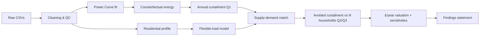

# Heat Smart Orkney — Notebook Pipeline Plan (`pla.md`)

> **Owner:** AiB 2026 capstone team · **Client:** Kaluza × Community Energy Scotland · **Last reviewed:** 2026-05-06
>
> This document is the engineering blueprint for the consultancy deliverable. It maps every section of the Jupyter notebook, every dataset transformation, every figure, every assumption that must be logged, and the toolchain that turns the notebook into both a **technical HTML/PDF report** (for Kaluza's data team) and an **executive slide deck** (for the CEO/board).
>
> Read `Project.md` first for business context. This file is the *how*.

---

## 0. Guiding Principles

1. **Single source of truth.** One Jupyter notebook (`HSO_report.ipynb`) drives every output: technical report (HTML/PDF) and executive slides (reveal.js). No copy-pasting numbers between artefacts. Every figure and headline number is computed in code, cached to `outputs/`, and embedded by reference.
2. **Reproducibility before sophistication.** A high-school-level model that reproduces deterministically is worth more than a state-of-the-art model that doesn't. Pin the environment, seed every RNG, version the data hash.
3. **Assumption log is a first-class artefact.** Every numerical assumption (turbine count, wholesale price, flexible-load fraction, etc.) lives in a single YAML/JSON file (`config/assumptions.yaml`) and is shown in an explicit table in the report. Sensitivities are run by sweeping that file.
4. **Two audiences, one notebook.** Board-level cells are tagged for the slide export; deep-dive cells are tagged `skip` for slides but render in the technical report. We never maintain two narratives by hand.
5. **2017-only worldview.** Per the HSO FAQ, we are "in 2017" — no post-2017 data, no hindsight. Every external reference must be archive-dated ≤ 2017.
6. **The prize is in £/year.** Every analytical thread must terminate in £/year at the headline level. Methodology that doesn't ladder to that number is appendix material.

---

## 1. Repository Layout (target end-state)

```
AiB-Capstone/
├── pla.md                              # this file
├── Project.md                          # business brief
├── README.md                           # how to run / render
├── environment.yml                     # conda env (pinned)
├── requirements.txt                    # pip mirror for non-conda users
├── HSO_report.ipynb                    # ← THE deliverable
├── config/
│   ├── assumptions.yaml                # central parameter file
│   └── scenarios.yaml                  # low / central / high price scenarios, DR penetration grid
├── src/                                # importable Python modules (testable)
│   ├── __init__.py
│   ├── io_data.py                      # CSV loading, schema validation
│   ├── cleaning.py                     # gap detection, deduplication, TZ handling
│   ├── power_curve.py                  # filtering, fitting, evaluation
│   ├── curtailment.py                  # counterfactual energy, fleet scaling
│   ├── demand.py                       # household profiles, flexible-load fraction
│   ├── matching.py                     # supply-demand matching engine
│   ├── valuation.py                    # £ conversion, sensitivities
│   └── viz.py                          # plotting helpers, consistent style
├── tests/                              # pytest unit tests (small, fast)
│   ├── test_power_curve.py
│   ├── test_curtailment.py
│   └── test_matching.py
├── outputs/                            # generated by the notebook (gitignored except cache hash)
│   ├── figures/                        # PNG/SVG, named by section
│   ├── tables/                         # CSV exports of every table shown
│   └── cache/                          # parquet caches keyed by data hash
├── reports/                            # rendered exports (gitignored)
│   ├── HSO_report.html
│   ├── HSO_report.pdf
│   └── HSO_slides.html                 # reveal.js
└── Data/                               # raw CSVs (already in repo)
    ├── Turbine_telemetry.csv
    └── Residential_demand.csv
```

**Why this split:** the notebook orchestrates and narrates; `src/` holds the logic that is *tested* and *imported*. Logic that lives only in the notebook can't be unit-tested and tends to rot. Reviewers can spot-check `src/curtailment.py` without scrolling through markdown.

---

## 2. Toolchain & Rendering Pipeline

### 2.1 Environment

- Python 3.11, conda-managed.
- Core: `numpy`, `pandas`, `scipy`, `matplotlib`, `seaborn`, `pyarrow` (parquet caches), `pyyaml`.
- Modelling: `scikit-learn` (isotonic / spline fits), `statsmodels` (loess / quantile regression for the power curve, confidence bands).
- Notebook: `jupyterlab`, `ipykernel`, `nbconvert`, `nbformat`, `papermill` (parameterised re-runs for sensitivity sweeps).
- Quality: `pytest`, `ruff`, `black`, `nbqa`.
- Rendering: **Quarto** (preferred) for HTML/PDF/slides from a single notebook source; `nbconvert --to slides` (reveal.js) as fallback.

### 2.2 Single-source-to-three-formats render

| Output | Audience | Tool | Command |
| --- | --- | --- | --- |
| `HSO_report.html` | Kaluza data team | Quarto | `quarto render HSO_report.ipynb --to html` |
| `HSO_report.pdf` | Submission archive | Quarto + LaTeX | `quarto render HSO_report.ipynb --to pdf` |
| `HSO_slides.html` | Board presentation | Quarto reveal.js | `quarto render HSO_report.ipynb --to revealjs` |

Cells are tagged with notebook metadata so the same source produces all three:

| Tag | Behaviour in technical report | Behaviour in slides |
| --- | --- | --- |
| *(none)* | Shown | Shown |
| `slide` | Shown | Starts a new slide |
| `subslide` | Shown | Vertical sub-slide |
| `fragment` | Shown | Animated reveal |
| `notes` | Hidden | Speaker notes |
| `appendix` | Shown in §15 | Hidden |
| `skip-slides` | Shown | Hidden (technical detail) |
| `skip-report` | Hidden | Shown (e.g. board-only headline) |

A `tools/render_all.sh` script runs all three in CI-style sequence; pre-commit hook re-runs the notebook end-to-end so committed outputs are never stale.

### 2.3 Determinism & caching

- Every cell reads from `Data/`, transforms, and writes a parquet cache to `outputs/cache/<step>_<datahash>.parquet`. On re-run, if the data hash matches, the cache is read instead of recomputed. This keeps the notebook executable in <2 minutes on a laptop after the first run.
- `papermill` parameterises `config/assumptions.yaml` so sensitivity sweeps (price scenarios, turbine counts, flexible-load fractions) are automated, not hand-edited.

---

## 3. Notebook Section-by-Section Plan

The notebook follows the official rubric (`HSO project guidelines.pdf`), augmented with the mandatory power-curve section from `Project.md`. Each subsection below is a *spec*: purpose, inputs, methodology, outputs, assumptions logged, sensitivity tests, validation, and slide treatment.

> **Formatting rules** (from `Formatting Rules.txt`): active voice, concise sentences, no spelling errors, full QA pass before submission. Every figure has a caption that names the question it answers.

### Section 1 — Title Page `[slide]`

- **Purpose:** Frame the deliverable.
- **Content:** Title (target: *"Heat Smart Orkney: Sizing the £/year Prize from Residential Demand Response"*), team, role assignments (project lead, QA lead, analytics lead), submission date, version hash.
- **Slide treatment:** Single title slide.
- **Validation:** Title under 12 words; passes plain-English readability check.

### Section 2 — Executive Summary `[slide][slide]`

- **Purpose:** One paragraph (≤180 words) covering objective → procedure → results → discussion → conclusion. Per the rubric this is the *first* thing read; it must stand alone.
- **Procedure for writing it:** Drafted *last*, after the findings statement. Numbers injected by f-string from cached results so they cannot drift from the analysis.
- **Slide treatment:** Headline £/year and household-count number on slide 2; assumptions footnoted.
- **Validation:** Reads cleanly without the rest of the notebook; every number traceable to a section reference.

### Section 3 — Introduction `[slide]`

- **Purpose:** Frame the business problem, the three core questions, and the analytical approach.
- **Sub-sections:**
  - 3.1 Business context (Orkney, 40 MW cable, curtailment economics) — distilled from `Project.md` §2.
  - 3.2 The three core questions (verbatim from `Project Case Transcript.txt`).
  - 3.3 **Findings statement (placeholder).** The rubric mentions hypotheses; per `Project.md` §3.3 we deliver a *findings statement* in lieu of formal hypothesis testing because the brief itself is a sizing exercise, not a falsifiable claim. The introduction states the *predictive priors* we will test against:
    - **P1** — Annual curtailment is non-trivial (≥10 GWh/yr at fleet scale).
    - **P2** — Curtailment events are temporally concentrated, so DR has high marginal value at low penetration but diminishing returns above a critical N.
    - **P3** — A meaningful share (>30%) of curtailment is recoverable at <50% household enrolment.
    Each prior is closed out in §11 (Findings).
  - 3.4 Approach overview (one paragraph + the pipeline diagram below).
- **Figure 3.1 — Pipeline diagram (mermaid).**



- **Slide treatment:** Slide for the problem, slide for the three questions, slide for the pipeline.

### Section 4 — Technologies & Techniques `[skip-slides]`

- **Purpose:** Reproducibility. A reader of the technical report should be able to clone the repo and re-run end-to-end.
- **Content:**
  - Environment (`environment.yml` excerpt).
  - Data provenance: file paths, SHA-256 hashes of the two CSVs.
  - Module map (`src/` overview).
  - Method summary table (one row per analytical step → method → key parameters → reference).
  - Reproducibility commands (`make notebook`, `make slides`, `make pdf`).
- **Slide treatment:** Hidden from board deck.

### Section 5 — Data Audit & Cleaning (Stage 1) `[skip-slides]`

- **Purpose:** Establish a clean, gap-aware, time-zone-consistent dataset and document everything we changed.

#### 5.1 Schema validation

- Load both CSVs with explicit dtypes (`io_data.load_turbine`, `io_data.load_demand`).
- Assert column names and types match the spec in `Project.md` §4.
- Persist the loaded DataFrames to parquet caches.

#### 5.2 Timestamp hygiene

- Parse to `datetime64[ns, UTC]`. Document the assumed time zone (the brief is silent — assume UTC and flag this in the assumption log).
- Detect and report:
  - Duplicate timestamps (drop, document count).
  - Gaps > 1 minute (turbine) / > 30 minutes (demand). Persist a `gaps.csv` table.
  - Out-of-order rows.
- Reindex onto a regular grid with `NaN` for gaps; never forward-fill silently.

#### 5.3 Sanity checks (per dataset)

- **Turbine:**
  - Negative power readings → flag and drop.
  - `Power_kw > Setpoint_kw` cases (FAQ acknowledges these are real but rare). Quantify share; if <0.5% drop; otherwise model.
  - Zero-power-with-wind cases — could be curtailment (`Setpoint_kw == 0`) or downtime. Tag each row with a **regime** label: `{normal, curtailed, downtime, storm-cutout, anomaly}` using the rules in §6.1.
  - Storm cutout rule (FAQ): 10-min mean wind > 25 m/s OR peak > 30 m/s.
- **Demand:**
  - `N_households` step-changes. The FAQ flags the Sept-Oct 2017 jump to ~32k as anomalous — bucket the year by `N_households` regime and document.
  - Negative or zero `Demand_mean_kw` → drop.
  - Plot `Demand_mean_kw` and `N_households` overlaid; mark regime boundaries.

#### 5.4 Outputs

- **Figure 5.1** — Timestamp coverage strip plot for both datasets (highlights the 2017 overlap).
- **Figure 5.2** — Distribution of regime labels across the turbine record.
- **Figure 5.3** — `N_households` over time (demand dataset), regime-shaded.
- **Table 5.1** — Cleaning ledger: rows in, rows out, rows dropped per rule, per dataset.
- **Assumptions logged:** timezone, anomaly thresholds, drop rules.

#### 5.5 Sensitivity hooks

- Re-run the entire downstream pipeline once with the Sept-Oct demand anomaly *included* and once *excluded* — this becomes a sensitivity bar in §10.

### Section 6 — Power Curve Construction (Stage 2) `[slide]`

> **Mandatory deliverable** (`Project.md` §5, Stage 2). The curve is both an analytical artefact in its own right and the engine for §7's counterfactual.

#### 6.1 Curtailment / regime detection rules

- A row is **uncurtailed** iff:
  - `Setpoint_kw >= nameplate * 0.99` (threshold = 99% of nameplate, configurable), AND
  - 10-min mean wind ≤ 25 m/s and 60-second peak ≤ 30 m/s (storm rule), AND
  - `Power_kw` not flagged as `downtime` (zero power with wind > cut-in for ≥ 5 consecutive minutes).
- Nameplate is inferred as the modal `Setpoint_kw` over the full record (sanity-check against the 99th percentile of `Power_kw`).
- Output: `regime` column persisted on the cleaned turbine frame.

#### 6.2 Curve fitting

- **Family of fits we will compare:**
  1. **Binned-mean curve** (1 m/s bins). Simple, robust, transparent. Our default.
  2. **Isotonic regression** on (wind, power) over the cut-in→rated range. Monotonicity is physically required.
  3. **Logistic / 4-parameter sigmoid** (cut-in, ramp slope, rated, cut-out flag). Continuous, parametric, easy to communicate.
  4. **(Optional) LOWESS** for residual diagnostics, not as the primary fit.
- **Selection criterion:** RMSE on a held-out 20% of uncurtailed minutes, plus visual inspection. We commit to the binned-mean curve as the *headline* method (transparent, defensible) and report sigmoid/isotonic as robustness checks.

#### 6.3 Curve characterisation

- Estimate and report: cut-in speed (first non-zero bin), rated speed (knee of the plateau), rated power, cut-out behaviour (drop above 25 m/s).
- Compare against published manufacturer curves for typical Orkney-scale turbines (e.g. Enercon E-44 / Vestas V27 / community-scale 900 kW class — referenced from 2017-or-earlier sources only).
- Drift check: split the uncurtailed sample into 2015, 2016, 2017 vintages; refit; compare curves. Comment on aging.

#### 6.4 Outputs

- **Figure 6.1** — Scatter (wind, power) coloured by regime, with the binned-mean curve overlaid.
- **Figure 6.2** — Comparison of the three fitted curves on the same axes.
- **Figure 6.3** — Per-year curves (2015 / 2016 / 2017), to surface drift.
- **Figure 6.4** — Residual plot (predicted − actual) by wind bin, with bootstrap confidence band.
- **Table 6.1** — Curve parameter table: cut-in, rated speed, rated power, cut-out, RMSE, R².
- **Slide treatment:** One slide with Fig 6.1 and the headline parameters; technical comparison hidden from board deck.
- **Validation:** Bootstrap 95% CI for each binned-mean point; assert monotonicity from cut-in to rated; sanity-check rated-power estimate against modal `Setpoint_kw`.

### Section 7 — Question 1: Annual Curtailed Energy (Stage 3) `[slide]`

#### 7.1 Counterfactual energy per minute

- For every row with `regime == curtailed`:
  - `expected_kw = power_curve(Wind_ms)`
  - `lost_kw     = max(0, expected_kw − Power_kw)`
  - `lost_kwh    = lost_kw * (interval_minutes / 60)`
- Aggregate by hour, day, month, and the full overlap year (2017).

#### 7.2 Fleet scaling — single turbine → Orkney

- Per the HSO FAQ the dataset is **one turbine**. Scale to a fleet:
  - **Headline assumption:** `N_turbines = 500` (FAQ-suggested figure; logged as `assumptions.fleet_size`).
  - **Robustness:** also report 250 / 750 / 1000 to bracket sensitivity. The 500 figure is itself uncertain — flag this prominently.
  - **Refinement:** Orkney's curtailment-order rule is "newest first". We treat the modelled turbine as a *representative* unit; we do not attempt per-turbine modelling absent per-turbine data.
- Apply a fleet-correlation discount factor (default 1.0; sensitivity at 0.85 to acknowledge that not all turbines are curtailed simultaneously). This factor is logged and discussed.

#### 7.3 Annualisation

- The 2017 data covers a full calendar year — no annualisation needed for the headline. For pre-2017 partial years, annualise by Monte-Carlo bootstrap of monthly totals; do this as a robustness check only.

#### 7.4 Outputs

- **Figure 7.1** — Time series of curtailed energy (daily) across 2017.
- **Figure 7.2** — Heatmap: curtailed MWh by month × hour-of-day. Reveals when curtailment clusters (windy nights are the prior).
- **Figure 7.3** — Cumulative curtailment over 2017 — the "staircase" — with the headline annual figure annotated.
- **Figure 7.4** — Sensitivity bar: annual curtailment under fleet sizes {250, 500, 750, 1000} and correlation factors {0.85, 1.0}.
- **Table 7.1** — Headline number with 90% confidence interval (bootstrap over the curve fit).
- **Headline number:** `Annual_Curtailment_MWh_per_year_central` (single Orkney-wide figure).
- **Slide treatment:** A single slide with Fig 7.3 plus the headline MWh and £ (forward-referenced from §10) figure.

### Section 8 — Residential Demand Modelling (Stage 4) `[skip-slides]`

#### 8.1 Per-household profile

- Resample to 30-min (already native). Compute the typical daily profile (mean, p10, p90 by half-hour-of-day) on the *stable* `N_households` regime (drop the Sept-Oct anomaly per §5.5).
- Compute weekday vs weekend, summer vs winter splits.

#### 8.2 Flexible-load decomposition

- We need the **shiftable** share of demand — the fraction that DR can dispatch into curtailment windows. Approach:
  - **Baseline / always-on** load = the rolling 24h minimum of `Demand_mean_kw` (lights, fridge, standby, etc.). Not DR-addressable.
  - **Variable** load = total − baseline. A heuristic share of variable load (e.g. heating + hot water) is treated as DR-addressable.
  - **Headline assumption:** flexible fraction `f_flex = 0.40` of variable load is shiftable (electric heating + immersion). Logged in `assumptions.f_flex`.
  - **Robustness:** sweep `f_flex ∈ {0.20, 0.40, 0.60}`.
- Per-household *DR uptake capacity* is the kWh of energy a single enrolled household can absorb during a curtailment event, capped by:
  - Half-hour kW capacity (= flexible-share × average flexible kW + thermal-storage headroom).
  - Daily energy budget (no household can absorb more than its daily heat demand).

#### 8.3 Heater / device sizing (from FAQ)

- Heat-smart device retrofit cost: **£100 per radiator** (FAQ).
- Quantum heater unit cost: current market price × 0.5 (FAQ — to back-cast to 2017).
- Logged in `assumptions.device_costs`.

#### 8.4 Outputs

- **Figure 8.1** — Average daily demand profile (per household), with weekday/weekend overlay and 10–90 percentile band.
- **Figure 8.2** — Decomposition: baseline vs variable vs flexible.
- **Figure 8.3** — Seasonal demand shift (winter > summer; relevant because curtailment is also seasonal).
- **Table 8.1** — Per-household flexible kWh available per half-hour, by season and time-of-day.
- **Validation:** Total annual demand per household × 10,385 households should be in the right ballpark for Orkney domestic demand (rough cross-check against any 2017-or-earlier published Orkney electricity figure if obtainable archived; document).

### Section 9 — Supply-Demand Matching (Stage 5, Q2 & Q3) `[slide]`

#### 9.1 Matching engine

- For each curtailed half-hour `t` in 2017:
  - `supply_kwh(t)` = curtailed energy in that half-hour (from §7, resampled to 30-min).
  - `per_household_kwh(t)` = absorbable energy per enrolled household at `t` (from §8).
  - `absorbed_kwh(t, N) = min(supply_kwh(t), N × per_household_kwh(t))`
  - `avoided_curtailment(N) = Σ_t absorbed_kwh(t, N)`
- Sweep `N ∈ {0, 100, 250, 500, 1000, 2000, 5000, 10000, 10385}`.

#### 9.2 Diversity & coincidence

- Households are not perfectly available at every event. Introduce an **availability factor** `a` (default 0.7) representing the share of enrolled homes whose flexible appliance is *available to dispatch* at any given event. Logged as `assumptions.availability`. Sensitivity at {0.5, 0.7, 0.9}.

#### 9.3 Diminishing returns analysis

- Plot `avoided_curtailment(N) / annual_curtailment_MWh` vs `N`.
- Fit an empirical saturating curve (e.g. `1 − exp(−N / N_0)`) and report `N_0`, the characteristic enrolment scale.
- Identify and annotate:
  - `N_50%` — households needed to absorb 50% of curtailment.
  - `N_80%` — households needed to absorb 80%.
  - `N_max` — point of diminishing returns (defined as where marginal avoided MWh per additional household drops below a threshold).

#### 9.4 Outputs

- **Figure 9.1** — Avoided curtailment vs household enrolment, with diminishing-returns curve fit and 50% / 80% annotations.
- **Figure 9.2** — Absorption time-series for a representative high-curtailment week, comparing N=500 vs N=5000 enrolments.
- **Figure 9.3** — Sensitivity ribbons on Fig 9.1 from `f_flex` and `availability` sweeps.
- **Table 9.1** — `(N, avoided_MWh, avoided_%, £_value)` rows.
- **Headline numbers:**
  - **Q2 answer:** % curtailment avoided at 5% / 10% / 25% / 50% / 100% household penetration.
  - **Q3 answer:** households needed to hit each target avoidance level.
- **Slide treatment:** Fig 9.1 with the two headline annotations is *the* board-deck slide for Q2/Q3.

### Section 10 — Valuation & Sensitivity (Stage 6) `[slide]`

#### 10.1 Wholesale price scenarios

- Three scenarios (logged in `config/scenarios.yaml`), all sourced ≤ 2017:
  - **Low:** £35/MWh (early-2010s baseload trough).
  - **Central:** £45/MWh (2017 day-ahead average, rounded).
  - **High:** £55/MWh (winter peak).
- £/year = avoided MWh × wholesale £/MWh.

#### 10.2 Subsidy break-even (per FAQ)

- Compute Kaluza break-even at subsidy levels of 25%, 50%, 75%, 100% of household energy cost (per HSO FAQ guidance).
- Use a simple cost stack:
  - Per-household install: £100 retrofit + heater unit cost (2017-deflated).
  - Variable cost: 0 (assumed amortised per FAQ).
  - Revenue: avoided-curtailment value share to Kaluza (default 1/3 of avoided-curtailment £, sensitivity at 1/4 and 1/2).
- Compute payback period in years for each subsidy level and each penetration scenario.

#### 10.3 Tornado chart

- Vary one assumption at a time (`fleet_size`, `f_flex`, `availability`, wholesale price, value share, `N`) by ±50% (or scenario range) and plot the resulting £/year shift.
- Surfaces *which assumptions matter* — sets the agenda for client follow-ups.

#### 10.4 Outputs

- **Figure 10.1** — Three-scenario £/year curtailment value (low/central/high price) at central penetration.
- **Figure 10.2** — Tornado chart of £/year sensitivity to each assumption.
- **Figure 10.3** — Payback period heatmap (subsidy × penetration).
- **Table 10.1** — Headline £/year and £/household across scenarios.
- **Slide treatment:** Fig 10.1 (the prize) and Fig 10.2 (what could move it) — two slides.

### Section 11 — Findings Statement `[slide][slide]`

- **Purpose:** Closes the priors P1–P3 from §3.3 and delivers the consultancy verdict.
- **Structure** (each as a single tight paragraph, evidence-backed, with figure references):
  1. **Scale of the prize.** Annual curtailment in MWh and £ (central + range).
  2. **Shape of curtailment.** When it happens, how concentrated, why this matters for DR tractability.
  3. **Household maths.** How many homes get to 50% / 80% avoided curtailment.
  4. **Business-case verdict.** What the prize is worth, sensitivity envelope, the two assumptions that move the answer most.
  5. **Recommendation to the board.** The decision Kaluza should take *next* (one sentence).
- **Drafting rule:** No findings statement is written before §10 is locked. Numbers are injected from cached results, not retyped.
- **Slide treatment:** Two slides — one "the prize" slide, one "what we recommend" slide.

### Section 12 — Discussion `[skip-slides]`

- Overall trend statement (the headline curtailment story).
- Explicit verdict against priors P1, P2, P3 (correct / partially correct / refuted, with caveats).
- Errors and uncertainty: confidence-interval discussion, places where the model is fragile, what we *can't* answer with this data.
- Strengths of the analysis (transparency of assumptions, fleet-scaling discipline, sensitivity coverage).
- Limitations (next section for detail; one-line foreshadow here).

### Section 13 — Limitations & Future Directions `[skip-slides]`

- **Data limitations:**
  - Single-turbine telemetry scaled to fleet — heterogeneity not captured.
  - One year of demand overlap — interannual variation invisible.
  - No per-household disaggregation of heating vs non-heating load.
  - Anomaly periods (Sept-Oct N-households jump) handled by exclusion, not by causal explanation.
- **Methodological limitations:**
  - Power-curve aging treated as a robustness check, not a primary correction.
  - Availability factor is heuristic; no probabilistic device-state model.
  - Wholesale price treated as time-invariant; in reality curtailment correlates with low prices.
- **Future directions:**
  - Per-turbine power-curve fitting (requires turbine-ID metadata from Kaluza).
  - Stochastic device-state model for availability.
  - Dynamic price coupling (curtailment events tend to coincide with low prices, which compresses the £ prize).
  - Longer demand window for interannual variability.
  - Heating-system-typed households (resistive vs heat pump vs storage) for differentiated DR potential.

### Section 14 — References `[skip-slides]`

- Convention: APA-style, archive-dated.
- Categories: Orkney energy context (≤2017 sources only), wind power-curve literature, demand-response literature, Kaluza/CES public materials, Python toolchain (cite versions).
- Build via a `references.bib` file referenced by Quarto so citations are rendered, not hand-typed.

### Section 15 — Technical Appendices `[appendix][skip-slides]`

The appendix is structured so Kaluza's data team can reproduce and extend without reading the prose:

- A.1 — Full assumption log (rendered table from `config/assumptions.yaml`).
- A.2 — Cleaning ledger (Table 5.1) with row-level rules.
- A.3 — Power-curve fit diagnostics (residual plots, per-vintage curves, bootstrap distributions).
- A.4 — Full sensitivity grid (every combination of fleet size × f_flex × availability × price scenario × N) as a sortable table.
- A.5 — Module-level API documentation auto-generated from `src/` docstrings.
- A.6 — Test results (`pytest -q` output).
- A.7 — How to re-run (commands, env hash, expected runtime, output diffing protocol).

---

## 4. Assumption Register (lives in `config/assumptions.yaml`)

The register below is the **complete** list of numeric assumptions the report makes. Every one of these is logged, cited, and swept in sensitivity analysis where flagged.

| ID | Assumption | Headline value | Source | Sensitivity range |
| --- | --- | --- | --- | --- |
| A1 | Orkney households | 10,385 | HSO FAQ | fixed |
| A2 | Fleet size (turbines) | 500 | HSO FAQ | {250, 500, 750, 1000} |
| A3 | Inter-turbine correlation factor | 1.00 | Engineering judgement | {0.85, 1.00} |
| A4 | Storm cutout (mean / peak m/s) | 25 / 30 | HSO FAQ | fixed |
| A5 | Nameplate-detection threshold | 99% of mode | Engineering judgement | {95%, 99%} |
| A6 | Flexible load fraction `f_flex` | 0.40 | Engineering judgement | {0.20, 0.40, 0.60} |
| A7 | Household availability factor | 0.70 | Engineering judgement | {0.50, 0.70, 0.90} |
| A8 | Wholesale price (central) | £45/MWh | 2017 day-ahead avg | {£35, £45, £55} |
| A9 | Per-radiator retrofit | £100 | HSO FAQ | fixed |
| A10 | Quantum heater unit cost | (current × 0.5) | HSO FAQ | ±25% |
| A11 | Kaluza value share | 1/3 | Engineering judgement | {1/4, 1/3, 1/2} |
| A12 | Subsidy break-even tiers | 25/50/75/100% | HSO FAQ | fixed grid |
| A13 | Anomaly handling: Sept-Oct demand | excluded | FAQ + §5 | {include, exclude} |
| A14 | Time zone | UTC | Inferred | flagged for client |

---

## 5. Sensitivity & Scenario Strategy

Three layers, in order of importance:

1. **Tornado chart (Fig 10.2)** — one-at-a-time ±range perturbations. Surfaces ranking.
2. **Three-price-scenario headline (Fig 10.1)** — low / central / high £/year prize.
3. **Full grid (Appendix A.4)** — every combination, persisted as CSV, for Kaluza's team.

We do **not** present all combinations on slides — only the tornado and the three-scenario bar. The grid lives in the appendix.

---

## 6. Risk Register (engineering risks for the build)

| Risk | Trigger | Mitigation |
| --- | --- | --- |
| Power-curve overfit | Sigmoid fit chases noise | Use binned-mean as headline; sigmoid only for comparison |
| Curtailment over-counted | `Power_kw > Setpoint_kw` rows mis-tagged | Explicit regime taxonomy; quantify share before fitting |
| Single-turbine bias | 500× scaling hides heterogeneity | Sensitivity over fleet size + correlation factor |
| Demand anomaly contamination | Sept-Oct N-households jump warps profile | Run pipeline both with and without; show delta |
| Wholesale-price hindsight | Using post-2017 figures violates brief | Lock price scenarios to ≤2017 sources only |
| Notebook drift | Numbers in prose diverge from code | Every number injected via f-string from cached cells; nbqa pre-commit |
| Render breakage | Slides differ from report | `tools/render_all.sh` runs all three renders before every PR |
| Late QA | QA crammed into final week | QA lead reviews each section as it lands, not at the end |

---

## 7. Build Order & Dependencies

The pipeline is a DAG. The build order (which is also the merge-PR order) follows topological sort:

```
1. Section 4 (env, repo skeleton, src/, tests scaffold)        ── depends on: nothing
2. Section 5 (cleaning + regime tagging)                       ── depends on: 1
3. Section 6 (power curve)                                     ── depends on: 5
4. Section 7 (Q1 curtailment)                                  ── depends on: 6
5. Section 8 (demand profile + flex decomposition)             ── depends on: 5
6. Section 9 (matching engine, Q2/Q3)                          ── depends on: 7, 8
7. Section 10 (valuation + sensitivities)                      ── depends on: 9
8. Section 11 (findings statement) — written LAST              ── depends on: 7, 9, 10
9. Sections 2, 3, 12, 13 (narrative)                           ── depends on: 11
10. Section 14 references + Section 15 appendix                ── continuous
11. Section 1 title + final QA pass                            ── after everything
12. Render: HTML, PDF, slides, peer-eval pack                  ── final step
```

**Critical-path warning:** §6 → §7 → §9 → §10 is the single longest chain. Any slip in §6 (power curve) cascades. Plan to lock §6 by end of week 2.

---

## 8. QA Checklist (mandatory before submission)

- [ ] Notebook runs end-to-end on a clean clone in <5 minutes.
- [ ] Every figure has a caption that names the question it answers.
- [ ] Every table has a caption and a CSV export under `outputs/tables/`.
- [ ] Every numeric claim in prose is f-stringed from a cached cell — no hand-typed numbers.
- [ ] Three-format render passes: `quarto render` to HTML, PDF, revealjs.
- [ ] Pre-2017 reference policy: every reference dated ≤ 2017 (or flagged as inspiration only).
- [ ] Spell-check + grammar pass on every markdown cell.
- [ ] Active voice audit: passive constructions flagged and rewritten.
- [ ] Every assumption in §4 register appears at least once in the report body.
- [ ] Sensitivity tornado is up-to-date with the locked assumption set.
- [ ] Findings statement matches the numbers in the executive summary exactly.
- [ ] Peer-evaluation pack: a 1-page handout summarising headline numbers, ready for the Q&A role-play.
- [ ] Two team members (lead + QA lead) sign off in `QA_SIGNOFF.md`.

---

## 9. Presentation (≤10 min, target 8 min) — Slide Order

| # | Slide | Source section | Time |
| --- | --- | --- | --- |
| 1 | Title | §1 | 0:30 |
| 2 | The problem in one chart (curtailment timeline) | §3 + Fig 7.1 | 1:00 |
| 3 | The three questions | §3 | 0:30 |
| 4 | Approach in one diagram | §3 (mermaid) | 0:30 |
| 5 | Power curve = our measuring stick | §6 (Fig 6.1) | 1:00 |
| 6 | Q1: how much energy is lost | §7 (Fig 7.3) | 1:00 |
| 7 | Q2 + Q3: how many homes, how much saved | §9 (Fig 9.1) | 1:30 |
| 8 | The prize in £/year | §10 (Fig 10.1) | 1:00 |
| 9 | What could move the answer | §10 (Fig 10.2) | 0:30 |
| 10 | Recommendation | §11 | 0:30 |

**Speaker notes** (reveal.js `notes` slide attribute) carry the technical caveats that the slide deliberately omits. The full team stays on stage for Q&A, with sub-section ownership pre-assigned (one team member per analytical stage so any client question lands on a domain owner).

---

## 10. Roles & Cadence

| Role | Owner | Responsibility |
| --- | --- | --- |
| Project Lead | (assign on day 1) | Comms, journal, submission, weekly client coaching |
| QA Lead | (assign on day 1) | Section-by-section QA, final QA pass, signoff |
| Analytics Lead — Supply | (assign) | §5 turbine cleaning, §6 power curve, §7 Q1 |
| Analytics Lead — Demand | (assign) | §5 demand cleaning, §8 demand model, §9 matching |
| Valuation Lead | (assign) | §10 sensitivities, §11 findings, slide deck |

**Cadence:**
- Daily 5-min stand-up (yesterday / today / blockers).
- Weekly formal meeting (planning, review, demo of latest notebook render).
- Weekly client coaching session (booked via Hub).
- Rotate roles at the midpoint so every team member has touched supply, demand, and valuation.

---

## 11. Rendering Commands (pinned recipes)

```bash
# one-time setup
conda env create -f environment.yml
conda activate hso

# headless re-run (deterministic) + render all three formats
make all                               # wraps the four commands below

jupyter nbconvert --to notebook --execute --inplace HSO_report.ipynb
quarto render HSO_report.ipynb --to html        --output-dir reports/
quarto render HSO_report.ipynb --to pdf         --output-dir reports/
quarto render HSO_report.ipynb --to revealjs    --output-dir reports/

# sensitivity sweep (papermill drives parametric reruns)
papermill HSO_report.ipynb outputs/runs/run_high_price.ipynb -y "wholesale_price: 55"
```

A `Makefile` wires these together; CI (or a pre-commit hook) runs `make all` before every PR so the rendered outputs in `reports/` are never stale.

---

## 12. Definition of Done

The project is done when, *and only when*, all of the following are true:

1. `HSO_report.ipynb` runs end-to-end on a clean clone with `make all` in under 5 minutes and produces identical output hashes across two consecutive runs.
2. The three rendered artefacts (`HSO_report.html`, `HSO_report.pdf`, `HSO_slides.html`) exist under `reports/` and are visually QA'd.
3. Every item in §8 (QA checklist) is ticked.
4. The findings statement (§11) answers Q1, Q2, Q3 in plain English with sourced numbers and a stated uncertainty range.
5. The slide deck (§9) runs in 8 minutes when rehearsed by the presenter.
6. `QA_SIGNOFF.md` is committed with two signatures.

Anything short of this is a draft, regardless of how good the analysis looks.
